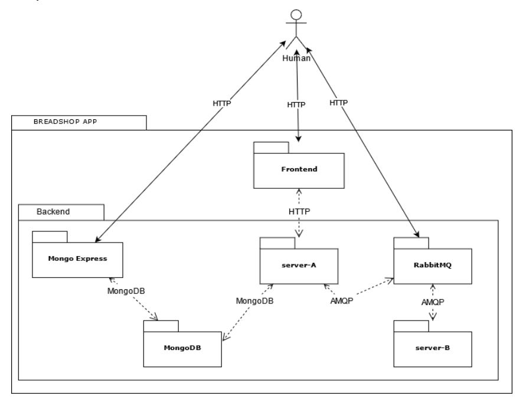
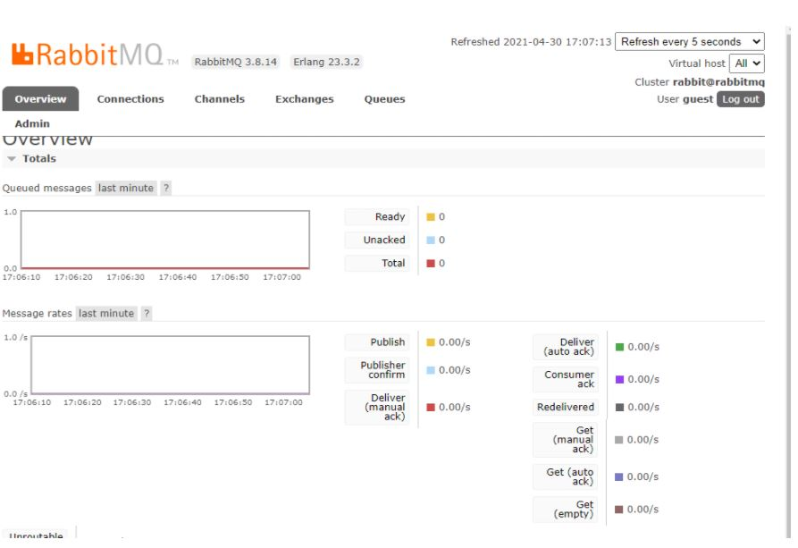
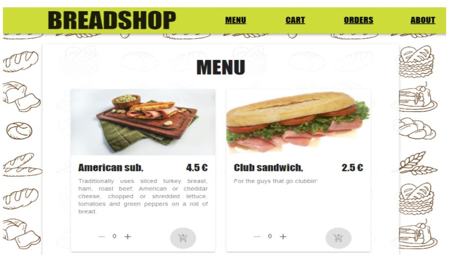
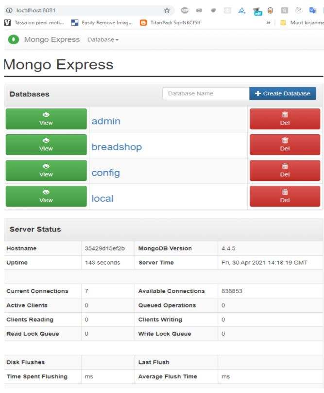
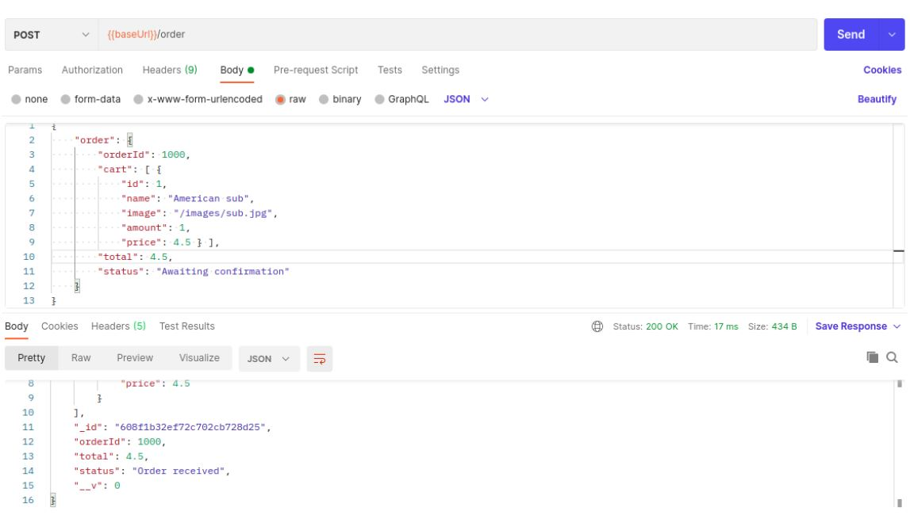
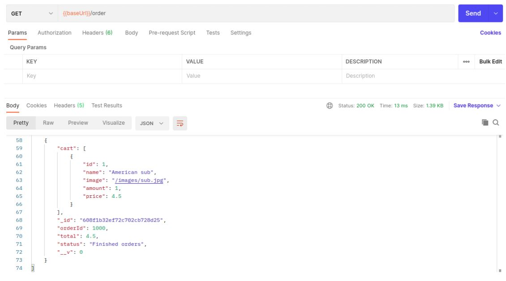
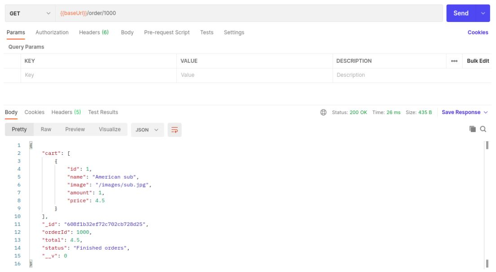
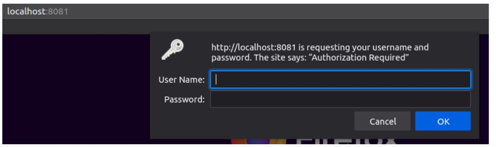
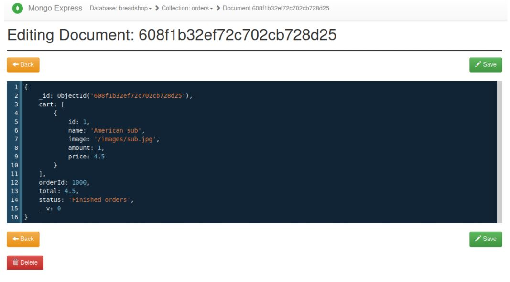

<!-- @format -->

# Breadshop

**Figure 0**: High-level view of the system architecture

## Documentation of the system

### Project group information

#### Group members

Jaakko Rajala jaakko.rajala@tuni.fi
Joni Nikki joni.nikki@tuni.fi

### Which group member(s) will be responsible for what

- Jaakko Rajala: Frontend and backend implementation, documentation
- Joni Nikki: Backend implementation, documentation

## System architecture

**Figure 1.** The UML graph representing the relationships of the different components.

The project incorporated much of the theory that was entertained in the Web Development- Architecture course held by [Tampere University](https://www.tuni.fi/opiskelijanopas/opintotiedot/opintojaksot/otm-fd2ca0d6-480a-40ba-b6d7-93fc3221704b?year=2020&q=null)- including component containerization and microservice architecture, asynchronous message brokering between two services as well as a dynamically rendered single-page application using a modern framework (React) in the frontend.

At principal importance was the configuration of all components being able to interface as illustrated by **Figure 1**, and such that the containers would come live in a predetermined manner. For instance, server A and server B depended on RabbitMQ being online and listening on port 15672. To achieve this, a script wait-for-it.sh was employed by server A and server B to delay their startup until RabbitMQ was responsive.

### Architectural patterns

#### Frontend: Redux Architecture

We decided to use react, and for react, we chose the redux architecture. Redux implements the idea of flux architecture, where user-driven events in the view create actions that are dispatched to the store- and the store itself updates the view/GUI in turn because of this. Additionally, redux introduces the idea of reducers and a centralized store for app state management. Reducers decide how the data changes exist, and the store holds the current state of the application.

#### Between frontend and backend: MVC

We took influences from the MVC-model, but there are certain modern principles such as React-Redux which breaks the normal conventions such as bidirectional data flow. Due to React, and more precisely redux, state management process of the application causes data to flow in the app [unidirectionally](https://redux.js.org/tutorials/fundamentals/part-2-concepts-data-flow#redux-application-data-flow). Server A has models and controllers seperated according to their respective standards.

#### Backend: Microservices

By dedicating each of the different workloads (serve user, order brokerage, data storage...) their own containers, microservices architecture is employed. The communication between components is stateless: everything that is needed for the processing of individual messages (context, parameters...) is included within the messages themselves.

### Components and their roles

#### Server-A

Server A manages sandwich orders from the Frontend with the help of Swagger API. It adds new orders to the message queue “received-orders” of rabbitMQ, changes a new orders status to “Order received”, then saves order details to the database. It responds to GET and POST requests regarding orders from the user, and updates order status upon receiving instructions to do so from RabbitMQ message queue “finished-orders”.

#### Server-B

Server B receives the messages from “received-orders” message queue through AMQP, and responds to it by changing the specified orders status to “Finished orders”, adding this updated order to the “finished-orders” message queue. Server-B serves as a way to “simulate” the process that would usually be done by the sandwich maker, who is supposed to see the order coming from the frontend and process it.

#### RabbitMQ

**Picture 1**: RabbitMQ-management

A message broker transmitting messages between Server-A and Server-B. It uses the AMQP protocol as a means of communication - see the section under _used protocols_. RabbitMQ management is accessible at port 5672 through HTTP, user name “guest”, password “guest”. .

---

Frontend

**Picture 2** : BREADSHOP-frontend

To access the frontend, use port 3000 on localhost. As seen from **Figure 1**, frontend interfaces with server-A through an HTTP REST API.

#### MongoDB

**Picture 3**. Mongo Express administrative interface.

MongoDB stores order info as supplied/retrieved by server-A. It uses the MongoDB protocol in interfacing with server-A and MongoDB express. MongoDB was exposed through the port 27017.

Mongo Express was used to observe the state of Mongo databases and associated collections. It is accessible at port 8081. It is meant as an administrative tool and is not meant to be exposed to end users. For administrative purposes, use “admin” as username, and “admin” as password when trying to access Mongo Express.

### Evaluating the architecture

#### Strengths (when compared to its purpose/task):

- Independency: Components are separated and do not depend on each other to function.
- Containerization: Thanks to Docker containers, we didn’t run into “it works on my machine” situations, where a commit would fail on another developer’s machine due to configuration mismatches in development environments.
- Rapid deployment: Since docker creates a container for every process and does not need to boot an os for each component separately, deploying the project takes seconds.

#### Weaknesses (when compared to its purpose/task):

- Performance: Uses perhaps excessive amounts of computational resources. Each container with a NodeJS application must download and install some overlapping packages.
- Overcomplicated frontend: For state management, we decided to use redux, but in truth, for an app as small as this, Redux is overkill. In case of React, we could’ve simply used hook-based system like useState or context to handle state and achieve a similar, albeit not as elegant result.
- Coordination: We feel a “chewing gum fix” was used in the form of wait-for-it.sh. This didn’t feel an intuitive way to arrange the startups of containers.

## Testing the project

### Project set-up

These steps are provided to access the project so as to make it ready for testing as described by the subsequent sections. To complete these steps, you need to have [Docker](https://docs.docker.com/get-docker/) installed. Since the frontend was not dockerized, you also need to have [node](https://nodejs.org/en/) to use npm.

Once previous software is installed, run the following commands in your preferred local folder:

1. Clone the repo
   > git clone github.com/Jalez/Breadshop
2. Open App folder
   > cd Breadshop
3. Start Docker compose (to run in the background)
   > sudo docker-compose up -d
4. Open frontend folder
   > cd frontend
5. Install dependencies
   > npm install
6. Start frontend
   > npm start

### Instructions to testing the Backend

As illustrated by **Figure 1**, the backend contains the microservice components, started up by Docker Compose in the previous subsection.

Following are the steps to place an order through an HTTP CRUD-request to server-a and seeing the order within the MongoDB database.

Due to witnessing the order status as “Finished orders”, we can see the order as having come a “full circle”.

[Postman](https://www.postman.com/downloads/) is used to discover the API advertised by server-a (exposed at port 12345). Start Postman > import API by URL > type in “localhost:12345/api-docs”.

At the left-side collection listing, click on “Make me a sandwich”, then go to Variables tab and set baseUrl to

> http://localhost:12345/v1

Save it (CTRL+S). Now you can send requests to the endpoints listed under order.

IDs of sandwiches are as follows:

- American sub: 1
- Club sandwich: 2
- Cheesesteak: 3

#### **POST**-request: in the screenshot below a trivial order is placed with one American sub (using the /order endpoint). Notice order status:

#### **GET**-request to see all orders (order status changed, granted you waited +30 seconds):

#### **GET**-request: Finding a single Orders info (ID=1000):

#### **Mongo-express**: Looking up single orders details in the database:

Open a web browser and navigate into localhost:8081. Give _admin/admin_ as credentials:

Navigate into breadshop>order by document id:

### Instructions to testing the Frontend

Once the frontend and backend is up, the following processes are available to the user:

1. Making an order
2. Updating the order
3. Getting all orders

The following steps from 1-8 accomplish each of the above processes.

#### Frontend extra: **Redux-dev-tools**

We have implemented the redux-dev-tools extension to our store for the curious mind, providing easy access to the applications Redux store and its state. To access it, you need to install the [browser extension](https://chrome.google.com/webstore/detail/redux-devtools/lmhkpmbekcpmknklioeibfkpmmfibljd?hl=fi). The extension can then be used on the frontend during runtime.
